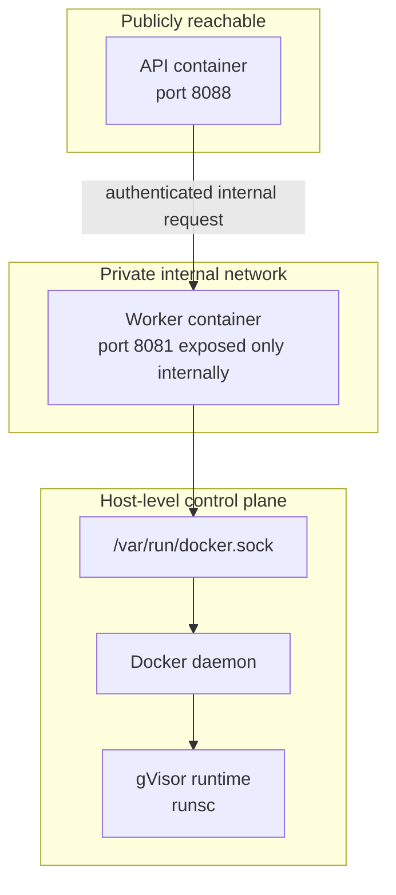
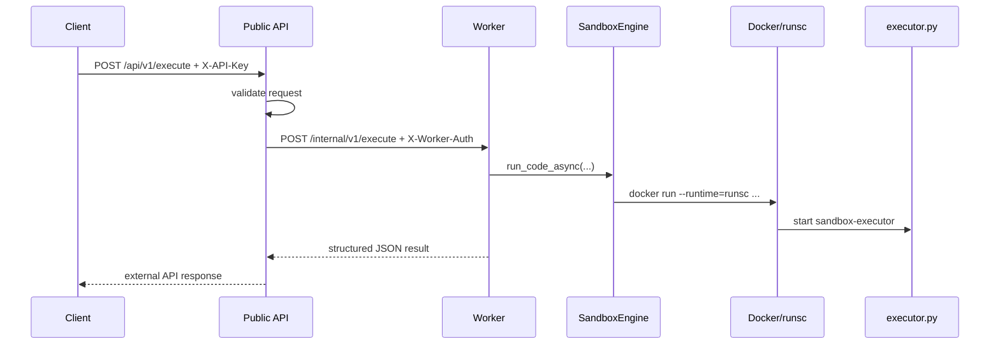
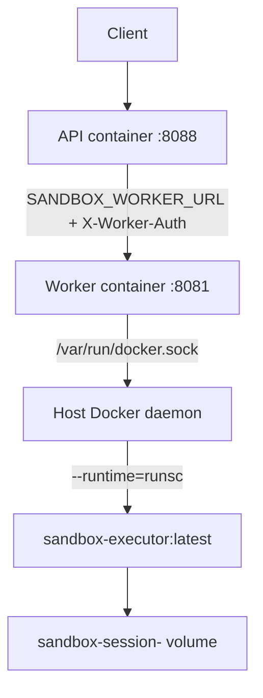

# Secure Sandbox Execution API

A small FastAPI service for running untrusted Python or shell code inside a gVisor-backed Docker container, with optional session-based persistent workspaces and file staging endpoints.

This project is designed to be used directly over HTTP or through the included Open WebUI tool file, [`openwebui_sandbox_tools.py`](/hms/apps/gvisor-sandbox-api/openwebui_sandbox_tools.py:1).

## What It Does

- Executes untrusted `python` or `shell` snippets inside a container started with `--runtime=runsc`
- Supports optional per-session persistent workspaces mounted at `/workspace`
- Lets clients write, read, list, and purge workspace files over HTTP
- Uses API key authentication via the `X-API-Key` header
- Uses a private worker service for all Docker/gVisor orchestration
- Includes an OpenAPI spec and an Open WebUI tool wrapper

## Project Layout

- [`api_gateway.py`](/hms/apps/gvisor-sandbox-api/api_gateway.py:1): public FastAPI gateway and HTTP endpoints
- [`worker_service.py`](/hms/apps/gvisor-sandbox-api/worker_service.py:1): private worker service with Docker access
- [`sandbox_engine.py`](/hms/apps/gvisor-sandbox-api/sandbox_engine.py:1): Docker/gVisor orchestration layer
- [`worker_client.py`](/hms/apps/gvisor-sandbox-api/worker_client.py:1): API-to-worker HTTP client
- [`executor.py`](/hms/apps/gvisor-sandbox-api/executor.py:1): code that runs inside the sandbox container
- [`openwebui_sandbox_tools.py`](/hms/apps/gvisor-sandbox-api/openwebui_sandbox_tools.py:1): Open WebUI tool integration
- [`openapi.yaml`](/hms/apps/gvisor-sandbox-api/openapi.yaml:1): API contract
- [`tests/`](/hms/apps/gvisor-sandbox-api/tests): unit and integration tests

## How It Works

1. A client sends code to `POST /api/v1/execute`.
2. The public API validates the request and forwards it to the private worker service.
3. The worker uses `SandboxEngine` to start a Docker container with gVisor (`runsc`).
4. The request payload is piped through `stdin` into [`executor.py`](/hms/apps/gvisor-sandbox-api/executor.py:1).
5. The executor optionally installs approved pip packages, runs the code, and returns JSON.

For workspace operations, the engine launches short-lived helper containers that mount the same `/workspace` volume and perform file reads/writes/listing safely inside the sandbox boundary.

## Architecture Diagrams

### Service Topology

```mermaid
flowchart LR
    Client[Client / Open WebUI / HTTP caller] --> API[Public FastAPI API<br/>api_gateway.py]
    API -->|Internal HTTP + X-Worker-Auth| Worker[Private Worker<br/>worker_service.py]
    Worker --> Engine[SandboxEngine]
    Engine -->|docker run --runtime=runsc| Docker[Host Docker Daemon]
    Docker --> Sandbox[gVisor Sandbox Container<br/>sandbox-executor:latest]
    Sandbox --> Workspace["/workspace volume"]
```



### Trust Boundary



### Request Lifecycle



## Security Model

Current protections in code:

- gVisor runtime via `--runtime=runsc`
- No direct code passed through host shell arguments; payloads are sent over `stdin`
- Workspace path normalization rejects absolute paths and `..` traversal
- File operations are constrained to `/workspace`
- API key authentication on all public endpoints
- Memory limit on containers with `--memory=256m`
- `--network=none` for workspace helper containers

Important notes:

- The public API no longer mounts `/var/run/docker.sock`; only the private worker does.
- Code execution containers use `--network=bridge` and `--dns=8.8.8.8`, so executed code can reach the network unless you change that behavior in [`sandbox_engine.py`](/hms/apps/gvisor-sandbox-api/sandbox_engine.py:74).
- Dynamic `pip install` is allowed for packages explicitly passed in `install_packages`.
- The `--pids-limit` setting is currently commented out in [`sandbox_engine.py`](/hms/apps/gvisor-sandbox-api/sandbox_engine.py:87).

## Requirements

- Python 3.11+
- Docker
- gVisor installed and configured as the Docker runtime `runsc`

Host prerequisites:

- Linux host
- `x86_64` or `arm64` architecture
- Linux kernel `4.14.77+`
- Docker `17.09.0+`

Python dependencies are listed in [`requirements.txt`](/hms/apps/gvisor-sandbox-api/requirements.txt:1):

- `fastapi`
- `httpx`
- `requests`
- `uvicorn`

## Host Prerequisites

Before running this service, make sure the host can launch Docker containers with the `runsc` runtime.

### 1. Install Docker

Install Docker first if it is not already available.

Quick check:

```bash
docker --version
```

### 2. Install gVisor

You have two common options on Linux.

Option A: install from the gVisor apt repository

```bash
sudo apt-get update && \
sudo apt-get install -y \
  apt-transport-https \
  ca-certificates \
  curl \
  gnupg

curl -fsSL https://gvisor.dev/archive.key | sudo gpg --dearmor -o /usr/share/keyrings/gvisor-archive-keyring.gpg
echo "deb [arch=$(dpkg --print-architecture) signed-by=/usr/share/keyrings/gvisor-archive-keyring.gpg] https://storage.googleapis.com/gvisor/releases release main" | sudo tee /etc/apt/sources.list.d/gvisor.list > /dev/null
sudo apt-get update && sudo apt-get install -y runsc
```

Option B: manual install of the latest release

```bash
(
  set -e
  ARCH=$(uname -m)
  URL=https://storage.googleapis.com/gvisor/releases/release/latest/${ARCH}
  wget ${URL}/runsc ${URL}/runsc.sha512 \
    ${URL}/containerd-shim-runsc-v1 ${URL}/containerd-shim-runsc-v1.sha512
  sha512sum -c runsc.sha512 \
    -c containerd-shim-runsc-v1.sha512
  rm -f *.sha512
  chmod a+rx runsc containerd-shim-runsc-v1
  sudo mv runsc containerd-shim-runsc-v1 /usr/local/bin
)
```

### 3. Register `runsc` with Docker

If `runsc` was not configured automatically, register it with Docker:

```bash
sudo runsc install
sudo systemctl restart docker
```

You can also configure Docker manually in `/etc/docker/daemon.json`. For example:

```json
{
  "runtimes": {
    "runsc": {
      "path": "/usr/local/bin/runsc",
      "runtimeArgs": [
        "--debug",
        "--debug-log=/tmp/gvisor-debug/"
      ]
    }
  }
}
```

After editing `/etc/docker/daemon.json`, restart Docker:

```bash
sudo systemctl restart docker
```

Notes:

- `runtimeArgs` are optional and useful for debugging gVisor runtime issues.
- The debug log directory must be writable by the runtime.
- If `daemon.json` already contains other Docker settings, merge the `runtimes` block into the existing JSON instead of replacing the whole file.

### 4. Verify the runtime

Confirm Docker can use gVisor:

```bash
docker run --runtime=runsc --rm hello-world
docker run --runtime=runsc --rm -it ubuntu dmesg
```

If the second command prints lines beginning with `Starting gVisor...`, the runtime is active.

## Docker Deployment

The API service is containerized as a public gateway plus a private worker. The worker binds the host Docker socket so `sandbox_engine.py` can call `docker run --runtime=runsc` against the host daemon, spawning gVisor sandbox containers as siblings.

Two distinct images are involved:

| Image | Dockerfile | Role |
|---|---|---|
| `sandbox-executor:latest` | `Dockerfile` | Runs untrusted code inside gVisor. Built once, used on-demand. |
| `sandbox-api` (compose) | `Dockerfile.api` | Hosts the public FastAPI service. No Docker socket access. |
| `sandbox-worker` (compose) | `Dockerfile.worker` | Hosts the private worker service. Has Docker CLI and Docker socket access. |

### Prerequisites

The host must have gVisor installed and `runsc` registered with Docker (see [Host Prerequisites](#host-prerequisites) below). The API container changes nothing about this requirement.

### Steps

**1. Build the sandbox executor image** (must exist in the host daemon before the API starts):

```bash
docker build -t sandbox-executor:latest .
```

**2. Configure environment variables:**

```bash
cp .env.example .env
# Edit .env and set SANDBOX_API_KEY and SANDBOX_WORKER_API_KEY to real secrets
```

**3. Build and start the API container:**

```bash
docker compose up --build -d
```

The API will be available at `http://localhost:8088`.

### How it works



The socket bind (`/var/run/docker.sock:/var/run/docker.sock`) now exists only on the worker container. Workspace volumes created by the engine persist in the host daemon's namespace across API or worker container restarts.

### Stop the service

```bash
docker compose down
```

---

## Setup

### 1. Install Python dependencies

```bash
pip install -r requirements.txt
```

### 2. Build the sandbox image

From the project directory:

```bash
docker build -t sandbox-executor:latest .
```

### 3. Set environment variables

```bash
export SANDBOX_API_KEY="change-me"
export SANDBOX_WORKER_API_KEY="change-me-worker-secret"
export SANDBOX_WORKER_URL="http://127.0.0.1:8081"
export SANDBOX_WORKER_TIMEOUT_SECONDS="90"
export SANDBOX_LOG_LEVEL="INFO"
export SANDBOX_PERSISTENT_WORKSPACE_DEFAULT="false"
export SANDBOX_VOLUME_PREFIX="sandbox-session"
```

Available environment variables:

- `SANDBOX_API_KEY`: API key required by the service
- `SANDBOX_WORKER_API_KEY`: shared secret between the public API and the private worker
- `SANDBOX_WORKER_URL`: base URL the public API uses to reach the worker
- `SANDBOX_WORKER_TIMEOUT_SECONDS`: timeout for API-to-worker calls
- `SANDBOX_LOG_LEVEL`: logging level for the API
- `SANDBOX_PERSISTENT_WORKSPACE_DEFAULT`: default workspace persistence when the request omits `persist_workspace`
- `SANDBOX_VOLUME_PREFIX`: prefix used when naming persistent Docker volumes

### 4. Run the worker

```bash
uvicorn worker_service:app --host 127.0.0.1 --port 8081 --reload
```

### 5. Run the API

```bash
uvicorn api_gateway:app --host 0.0.0.0 --port 8088 --reload
```

The API will be available at `http://localhost:8088`.
The worker should remain private; if you run both locally, keep it bound to a trusted interface only.

## API Overview

All endpoints require:

```http
X-API-Key: <your-api-key>
```

### Execute Code

`POST /api/v1/execute`

Example:

```bash
curl -X POST http://localhost:8088/api/v1/execute \
  -H "Content-Type: application/json" \
  -H "X-API-Key: $SANDBOX_API_KEY" \
  -d '{
    "type": "python",
    "session_id": "demo-session",
    "persist_workspace": true,
    "install_packages": [],
    "code": "print(\"hello from sandbox\")"
  }'
```

Typical response:

```json
{
  "stdout": "hello from sandbox\n",
  "stderr": "",
  "exit_code": 0,
  "session_id": "demo-session",
  "persist_workspace": true
}
```

### Write a Workspace File

`POST /api/v1/session/{session_id}/files/write`

```bash
curl -X POST http://localhost:8088/api/v1/session/demo-session/files/write \
  -H "Content-Type: application/json" \
  -H "X-API-Key: $SANDBOX_API_KEY" \
  -d '{
    "path": "inputs/report.txt",
    "content": "AI Agent Intelligence Report Data",
    "encoding": "utf-8",
    "overwrite": true,
    "persist_workspace": true
  }'
```

### Read a Workspace File

`POST /api/v1/session/{session_id}/files/read`

```bash
curl -X POST http://localhost:8088/api/v1/session/demo-session/files/read \
  -H "Content-Type: application/json" \
  -H "X-API-Key: $SANDBOX_API_KEY" \
  -d '{
    "path": "inputs/report.txt",
    "encoding": "utf-8",
    "persist_workspace": true
  }'
```

### List Workspace Files

`POST /api/v1/session/{session_id}/files/list`

```bash
curl -X POST http://localhost:8088/api/v1/session/demo-session/files/list \
  -H "Content-Type: application/json" \
  -H "X-API-Key: $SANDBOX_API_KEY" \
  -d '{
    "path": ".",
    "recursive": true,
    "persist_workspace": true
  }'
```

### Purge a Persistent Workspace

`DELETE /api/v1/session/{session_id}`

```bash
curl -X DELETE http://localhost:8088/api/v1/session/demo-session \
  -H "X-API-Key: $SANDBOX_API_KEY"
```

## Workspace Behavior

- When `persist_workspace` is `false`, the engine uses an ephemeral workspace mount.
- When `persist_workspace` is `true`, the engine derives a Docker volume name from the session ID and mounts it at `/workspace`.
- The same `session_id` lets you stage files and then execute code against them later.
- Purging a session removes the persistent Docker volume for that session.

## Open WebUI Integration

This repo includes [`openwebui_sandbox_tools.py`](/hms/apps/gvisor-sandbox-api/openwebui_sandbox_tools.py:1), which exposes the sandbox API as Open WebUI tools:

- `execute_code`
- `write_workspace_file`
- `read_workspace_file`
- `list_workspace_files`
- `purge_session_workspace`

Relevant tool environment variables:

- `SANDBOX_API_BASE_URL`
- `SANDBOX_API_KEY`
- `SANDBOX_PERSIST_WORKSPACE_DEFAULT`
- `SANDBOX_API_TIMEOUT_SECONDS`

## Testing

Run unit tests:

```bash
python -m unittest discover -s tests
```

Run live integration tests against a running server:

```bash
export SANDBOX_TEST_ENABLE_INTEGRATION=true
export SANDBOX_TEST_API_URL=http://localhost:8088
export SANDBOX_TEST_API_KEY=$SANDBOX_API_KEY
python -m unittest tests.test_integration_api
```

The integration tests cover:

- writing a file
- listing files
- reading a file
- executing code against the staged file
- purging the session workspace

## Known Limitations

- `executor.py` applies a 30 second subprocess timeout, but there is no stronger outer orchestration timeout yet
- `pip install` failures are not surfaced in a very detailed way to the caller
- Execution containers currently allow network access
- Resource controls are present but not fully hardened yet
- Binary file transport is supported, but clients must handle base64 encoding/decoding themselves

## Troubleshooting

- If `docker run --runtime=runsc ...` fails before this app even starts, fix the host gVisor installation first.
- If Docker cannot start containers with `--runtime=runsc`, verify gVisor is installed and Docker knows about the `runsc` runtime.
- If API calls return `403`, check `X-API-Key` and `SANDBOX_API_KEY`.
- If the public API returns worker connectivity errors, verify `SANDBOX_WORKER_URL`, `SANDBOX_WORKER_API_KEY`, and that the worker is reachable only from the intended private network or local interface.
- If persistent workspace behavior seems inconsistent, confirm `persist_workspace` is being sent explicitly and that `SANDBOX_PERSISTENT_WORKSPACE_DEFAULT` matches your expectation.
- If Open WebUI tool calls fail, verify `SANDBOX_API_BASE_URL` points to this service and the API key matches.

## See Also

- [`README_AI.md`](/hms/apps/gvisor-sandbox-api/README_AI.md:1) for the original AI-oriented architecture notes
- [`openapi.yaml`](/hms/apps/gvisor-sandbox-api/openapi.yaml:1) for the machine-readable API specification
- Official gVisor installation guide: https://gvisor.dev/docs/user_guide/install/
- Official gVisor Docker quick start: https://gvisor.dev/docs/user_guide/quick_start/docker/
